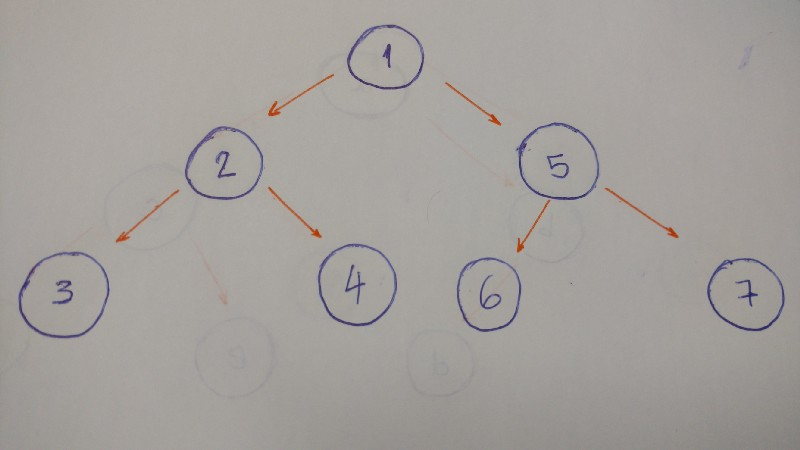
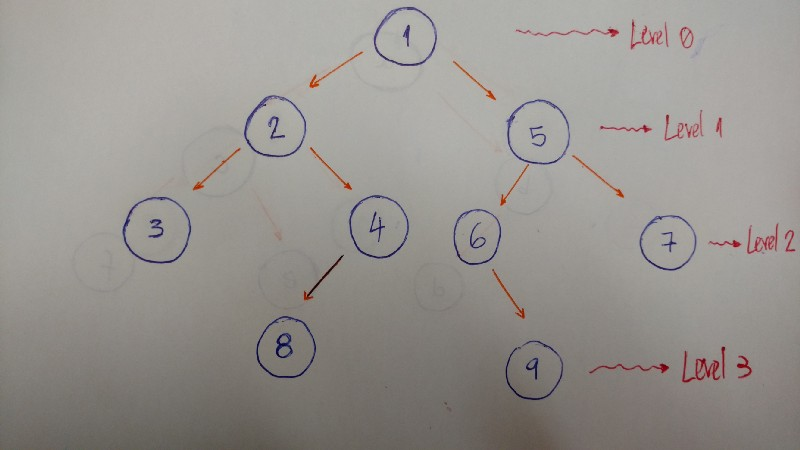

## Binary Tree 

### Intro
- Trees are well-known as a non-linear data structure. 
- They don’t store data in a linear way. 
- They organize data hierarchically.

### Real Life examples 
- Imagine a family tree with relationships from all generation: grandparents, parents, children, siblings, etc. 
- We commonly organize family trees hierarchically.
- An organization’s structure is another example of a hierarchy.
- In HTML, the Document Object Model (DOM) works as a tree.

### Tree
- A tree is a collection of entities called nodes. 
- Nodes are connected by edges. 
- Each node contains a value or data, and it may or may not have a child node .
- The first node of the tree is called the root. 
- If this root node is connected by another node, the root is then a parent node and the connected node is a child
- All Tree nodes are connected by links called edges. 
- It’s an important part of trees, because it’s manages the relationship between nodes.
- Leaves are the last nodes on a tree. 
- They are nodes without children. 
- Like real trees, we have the root, branches, and finally the leaves.
- The height of a tree is the length of the longest path to a leaf.
- The depth of a node is the length of the path to its root.

### Terminology summary
- Root is the topmost node of the tree
- Edge is the link between two nodes
- Child is a node that has a parent node
- Parent is a node that has an edge to a child node
- Leaf is a node that does not have a child node in the tree
- Height is the length of the longest path to a leaf
- Depth is the length of the path to its root

 ### Binary trees
 - A binary tree is a tree data structure in which each node has at the most two children, 
    - which are referred to as the left child and the right child.
    ~~~python
        class BinaryTree:
            def __init__(self, value):
                self.value = value
                self.left_child = None
                self.right_child = None
             
        tree = BinaryTree('a')
        print(tree.value) # a
        print(tree.left_child) # None
        print(tree.right_child) # None
    ~~~
    
#### Insert Node
- If the current node doesn’t have a left child, we just create a new nodeand set it to the current node’s left_child.
- If it does have the left child, we create a new node and put it in the current left child’s place. 
    - Allocate this left child node to the new node’s left child.
    ~~~python
        def insert_left(self, value):
        if self.left_child == None:
            self.left_child = BinaryTree(value)
        else:
            new_node = BinaryTree(value)
            new_node.left_child = self.left_child
            self.left_child = new_node
    ~~~           
     
### Tree Traversals
- Depth-First Search (DFS)  
    - is an algorithm for traversing or searching tree data structure. 
    - One starts at the root and explores as far as possible along each branch before backtracking.
    - DFS explores a path all the way to a leaf before backtracking and exploring another path.
    -  
    - Algorithm 
        - Start at the root (1). Print it.
        - Go to the left child (2). Print it.
        - Then go to the left child (3). Print it. (This node doesn’t have any children)
        - Backtrack and go the right child (4). Print it. (This node doesn’t have any children)
        - Backtrack to the root node and go to the right child (5). Print it.
        - Go to the left child (6). Print it. (This node doesn’t have any children)
        - Backtrack and go to the right child (7). Print it. (This node doesn’t have any children)
        - Done.
- Breadth-First Search (BFS)
    - is an algorithm for traversing or searching tree data structure. 
    - It starts at the tree root and explores the neighbor nodes first, before moving to the next level neighbors.      

#### Types of DFS 
##### Pre-order
- This is exactly what we did in the above example.
    - Print the value of the node.
    - Go to the left child and print it. 
        - This is if, and only if, it has a left child.
    - Go to the right child and print it. 
        - This is if, and only if, it has a right child.
        
    ~~~python
    def pre_order(self):
        print(self.value)
    
        if self.left_child:
            self.left_child.pre_order()
    
        if self.right_child:
            self.right_child.pre_order()
    ~~~    
        
##### In-order
- The result of the in-order algorithm for this tree example is 3–2–4–1–6–5–7.
- The left first, the middle second, and the right last.
- Go to the left child and print it. This is if, and only if, it has a left child.
- Print the node’s value
- Go to the right child and print it. This is if, and only if, it has a right child.        
    ~~~python
    def in_order(self):
        if self.left_child:
            self.left_child.in_order()
    
        print(self.value)
    
        if self.right_child:
            self.right_child.in_order()
    ~~~            
##### Post-order
- The result of the post order algorithm for this tree example is 3–4–2–6–7–5–1.
- The left first, the right second, and the middle last.
- Go to the left child and print it. This is if, and only if, it has a left child.
- Go to the right child and print it. This is if, and only if, it has a right child.
- Print the node’s value        
    ~~~python
    def post_order(self):
        if self.left_child:
            self.left_child.post_order()
    
        if self.right_child:
            self.right_child.post_order()
    
        print(self.value)
    ~~~           
         
#### Breadth-First Search (BFS)
- BFS algorithm traverses the tree level by level and depth by depth.
- To implement a BFS algorithm, we use the queue data structure to help.
-  
- So we traverse level by level. In this example, the result is 1–2–5–3–4–6–7.
- Level/Depth 0: only node with value 1.
- Level/Depth 1: nodes with values 2 and 5
- Level/Depth 2: nodes with values 3, 4, 6, and 7
    ~~~python
    def bfs(self):
        queue = Queue()
        queue.put(self)
    
        while not queue.empty():
            current_node = queue.get()
            print(current_node.value)
    
            if current_node.left_child:
                queue.put(current_node.left_child)
    
            if current_node.right_child:
                queue.put(current_node.right_child)
    ~~~            
    
##### BFS Implementation     
-  
- First add the root node into the queue with the put method.
- Iterate while the queue is not empty.
- Get the first node in the queue, and then print its value.
- Add both left and right children into the queue (if the current nodehas children).
- Done. We will print the value of each node, level by level, with our queuehelper.